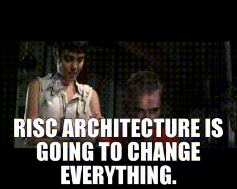

# ECE 492 RISC-V Project



Current schematic is sourced from
[here](https://www.youtube.com/watch?v=zW2Pmki81ow)

## Vivado

### Prerequisites

- Vivado

### Creating a project

- Open Vivado
- Go to Tools > Run Tcl Script... and select `fysh-fyve.tcl`

### Doing the demo

Launch Vivado in TCL mode.

```bash
# If project is not created yet
$ vivado -mode tcl
Vivado% source fysh-fyve.tcl
Vivado% open_project proj/fysh-fyve.xpr
# If the project has already been created
$ vivado -mode tcl proj/fysh-fyve.xpr
```

Generate the bitstream file.

```tcl
Vivado% source write-bitstream.tcl
```

Plug in the board and program.

```tcl
Vivado% source program-board.tcl
```

## GHDL

### Prerequisites

```
sudo apt install ghdl
```

If you want to format the code, you will need `emacs`.

```
sudo apt install emacs
```

Then run:

```
make -j fmt
```

### Testing

Simply run `make test` to run all testbenches in `test/`.

## Naming Convention

This is actually getting confusing 😭 especially without an LSP.

We don't need a good convention, we just need one.

- `NAME_i` - input port
- `NAME_o` - output port
- `NAME_t` - type
- `NAME_inst` - component instance

To also not confuse non-annotated identifiers with the annotated identifiers, we
should not end a variable name with `_[^iot]`.
