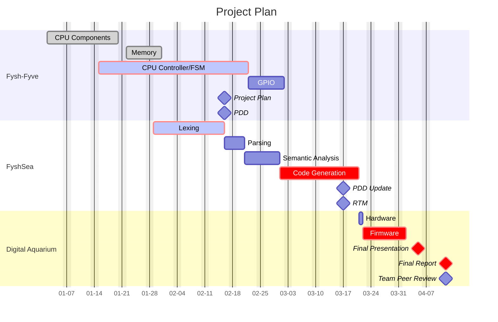

```mermaid
gantt
    dateFormat  YYYY-MM-DD
    axisFormat %m-%d
    title       Project Plan
    excludes    weekends
    %% (`excludes` accepts specific dates in YYYY-MM-DD format, days of the week ("sunday") or "weekends", but not the word "weekdays".)

    section Fysh-Fyve
    CPU Components :done, f51, 2024-01-02, 2w
    Memory               :done, f52,  after f51, 1w
    CPU Controller/FSM   :crit, active, f54, 2024-01-15, 4w
    GPIO                 :      f53,  after f54, 1w
    Project Plan         :milestone, 2024-02-16, 0d
    PDD                  :milestone, 2024-02-16, 0d

    section FyshSea
    Lexing            :crit, active, fs1, 2024-01-29, 2w
    Parsing           :fs2,  after fs1, 3d
    Semantic Analysis :fs3,  after fs2, 1w
    Code Generation   :crit, fs4,  after fs3, 2w
    PDD Update         :milestone, 2024-03-17, 0d
    RTM                :milestone, 2024-03-17, 0d

    section Digital Aquarium
    Hardware           : da1, after fs4 f54, 1d
    Firmware           :crit,     after da1, 1w
    Final Presentation :crit, milestone, 2024-04-05, 0d
    Final Report       :crit, milestone, 2024-04-12, 0d
    Team Peer Review   :milestone, 2024-04-12, 0d
```
